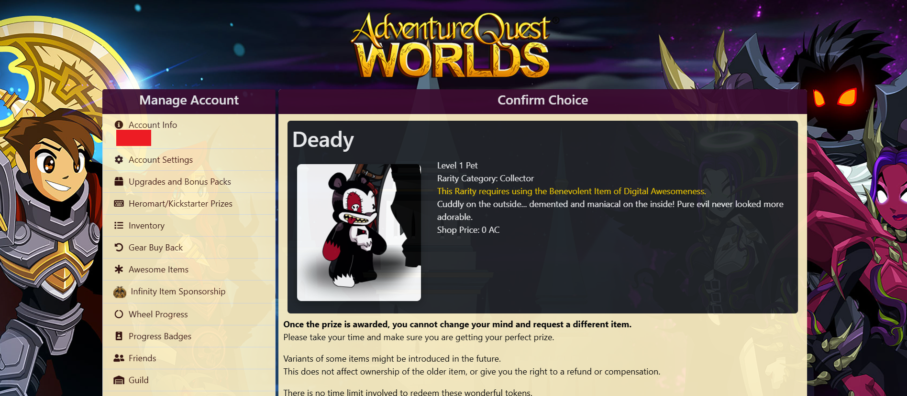
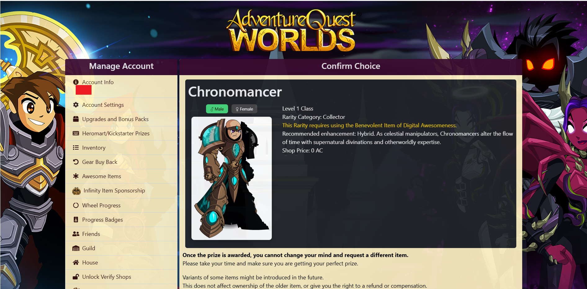

# AQW IoDA Preview

A Chrome extension that displays item images directly on the AQW IoDA page.

## Screenshots

## Features

- Shows item image below the item name
- Redirects pages to the aqwwiki
- Caching for faster loading

## Installation

### Manual Installation (Developer Mode)

1. Download or clone this repository
2. Open Chrome and go to `chrome://extensions/`
3. Enable **Developer Mode** (toggle in top-right)
4. Click **Load unpacked**
5. Select the extension folder

## How It Works

1. Detects when you're on IoDA Exchange page
2. Fetches the correct wiki page using background script
3. Extracts item image from wiki tabs (Male/Female if available)
4. Replaces the original content with a clean image + description layout

## Permissions

- `host_permissions`: Access to `account.aq.com` and `aqwwiki.wikidot.com`
- No data collection, no tracking

## Author

Darkero